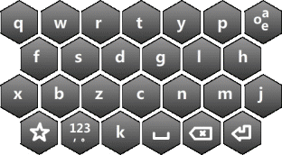
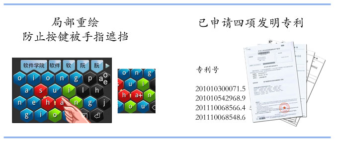
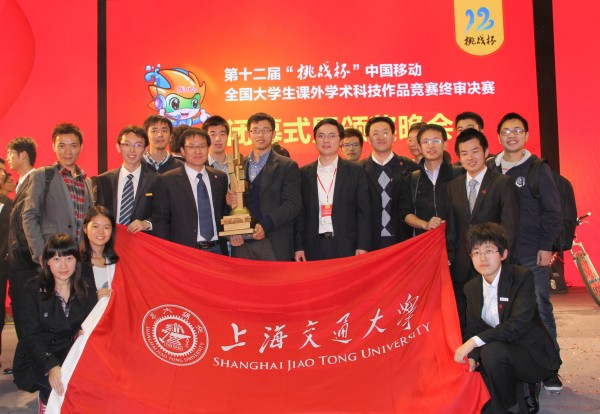
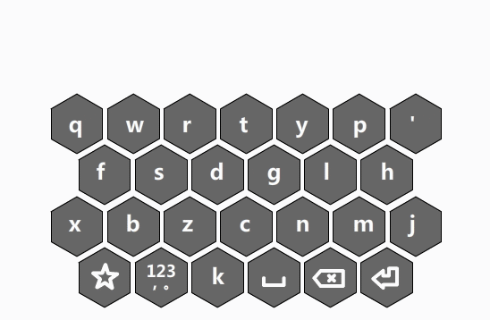
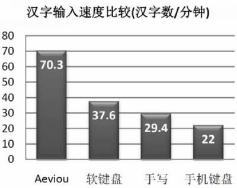
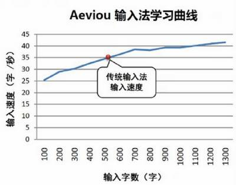
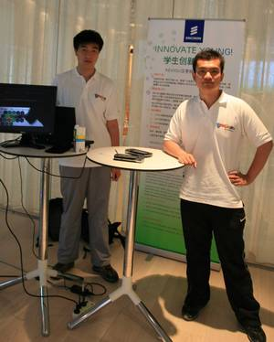
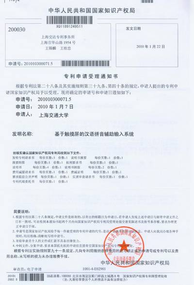

# AEVIOU中文滑行输入法

## AEVIOU中文滑行输入法（小蜜蜂滑行输入法）Android 2.0版本发布[2014.08]
[新特性](http://aeviou.sinaapp.com/)  [威锋论坛报道](http://bbs.feng.com/read-htm-tid-8221681.html)

微盘下载：http://vdisk.weibo.com/s/BK7pjOCcWheWv

百度云下载：http://pan.baidu.com/s/1gd69MEJ

[1.0 版本下载](http://pan.baidu.com/s/1sjI1bx7)

[新浪微博](http://weibo.com/u/1961313133/)
**微信公众号：**

  

**媒体报道**
**[上海交大获第十二届全国大学生“挑战杯”最高荣誉](http://news.sjtu.edu.cn/info/1003/107826.htm)**
[新民网：实现手机每分钟输入70个汉字 交大研发团队做客](http://news.xinmin.cn/t/msrx/2011/01/28/9127657.html)
[东方早报：手机触摸屏1分钟“滑”70个字](http://epaper.dfdaily.com/dfzb/html/2011-01/26/node_9.htm)
[视频: Aeviou输入法功能演示 （已经被播放100多万次）](http://v.youku.com/v_show/id_XMjM4MDc3MTU2.html)
[ipad版演示视频](http://v.youku.com/v_show/id_XMjEwMDU1NzI4.html)

**技术文档**
[技术特征](http://tcloud.sjtu.edu.cn/projects/aeviou/abstract.pdf)  [产品说明](http://tcloud.sjtu.edu.cn/projects/aeviou/tech.pdf)

# Trusted Cloud Group:Aeviou

## Aeviou简介
本项目是个专门为触摸屏设计的汉字输入法。本输入法充分利用了触摸屏上滑行的高效性和汉字拼音最多只有6个可能后继的特点。在传统软键盘的基础上，点击汉字的第一个拼音后，周围的键盘布局会动态改变。然后用滑行的方式输入。在输入效率上能提高很多。
经测试，此输入法稍经学习，既能达到每两秒一字的速度，极限速度可达每秒一字，超越目前市面上其他的移动设备使用的汉字输入法输入效率，是一个具有非常良好前景的输入法。

2014年8月，改进了Android版本，使得键盘输入布局更有规律，首键盘布局按照汉字字母拼音排列，展开键盘基本一致，便于记忆，支持简拼，加快输入速度，并支持记录输入速度，输入更有乐趣。

## Aeviou中文滑行输入法（小蜜蜂输入法）2.0 的Android更新说明
**点击输入真麻烦？试试AEVIOU的一滑输入**
**传统键盘太单调？试试AEVIOU的超炫动态键盘触屏**
**手机屏幕小？试试AEVIOU的精简蜂窝式键盘**

AEVIOU输入法推出伊始，凭借动态键盘、一滑输入等独特的创意，2012年推出了1.0版本，2014年推出了2.0版本，主要更新如下：
1. 支持键盘固定次序展开输入路径，例如gao、hao、cao、dao等输入路径，除了首字母不同外，“ao”的路径是固定的，故熟悉后，很快就能将后继路径输入。 以后的版本会针对路径的排列顺序进行修订。
2. 首字母的布局不同于qwert键盘，按照汉语拼音排列，例如jqx、bpmf、zcs、dtnl、gkh、yw、等排列，参照qwert的排序，次级键盘基本是按照aeviou 顺时针展开的，比较好记。这也是为什么ao的a在左边的缘故。有木有小时候学汉语拼音的感觉，可以用来训练小朋友学汉字。 以后也可以像第一版一样，加入qwert全键盘。精简键盘主要考虑手机小屏幕增大按键面积。
3. 支持简拼， 例如 输入XX，就可以得到学习、学校等候选，输入s‘hai得到上海、损害等词组，通过前缀匹配，不需要输入整个词组拼音
4. 扩大词库， 目前相对于1.0 版的1.2M左右，扩展到14M，主要是词库的更新。目前如果有谁有好的词库，我们可以加入进来。
5. 支持输入速度排名，为伙伴们增加一个输入速度的排名，实时看看你能输入多快，这个是在输入法设置“即时打字速度条“”打开的情况下统计，同时在应用里面可以看到输入速度和排名。以后排名靠前的我们进行不定期公布。
6. 最后，我们为aeviou增加了一个中文名，小蜜蜂输入法，希望大家喜欢。
说明：
为了统计输入速度和排名，我们通过网络链接收集了device id和输入速度，其他数据均没有收集。如果有其他数据收集，应该是重打包过的apk，请留意。最好到我们给出的官方下载处下载。

## 荣誉
AEVIOU蜂窝式中文滑行输入法团队，在终审决赛中创造佳绩，勇夺第12届“挑战杯”特等奖。

## 原理
Aeviou输入法借鉴了Swype的滑行理念，结合了汉语拼音每个字母后继最多可能不超过6个这一特性，定制了一套动态键盘。键盘会随着用户的输入而发生变化，保证所有汉字都能够无二义性的一笔划完。
下面是Aeviou使用的简介：

[综合演示视频](http://v.youku.com/v_show/id_XMjIzMTE3MTMy.html)  [Ipad演示视频](http://v.youku.com/v_show/id_XMjEwMDU1NzI4.html)

## 测试
 

## 团队
指导教师：[戚正伟](http://tcloud.sjtu.edu.cn/people/zhengwei/)、[梁阿磊](http://202.120.40.100/wiki/index.php/User:Liangalei)
创始人：范晔、[董浩亮](http://202.120.40.100/wiki/index.php/User:Donghl)、[夏嘉斌](http://202.120.40.100/wiki/index.php/User:Rexpie)、傅承彦

Android 2.0版本 开发团队： 金正男、陆昊天、杨智渊、洪荣集

## 专利

## 常见问答
1、**Aeviou输入法和Swype有什么联系与区别**
答：Aeviou输入法和Swype输入法都是专为触摸屏设计的输入法，他们基于的基本原理都是滑行手势要比点按手势更有效率。Aeviou输入法更适合汉语拼音输入，并且只适合汉语拼音输入，这是因为Aeviou利用了汉语拼音的每个字母后继不超过6个的特性。Aeviou动态键盘改变模式是Swype等其他输入法并不具备的，其能够保证滑行路径相对较短，并且无二义性。Aeviou的这一特性已经申请了国家专利。
2、**何处能够下载到Aeviou输入法？**
答：目前Aeviou输入法1.0在本网站或从百度云下载：http://pan.baidu.com/s/1sjI1bx7
3、**Aeviou输入法能够支持几个平台。**
答：从理论上来讲，Aeviou输入法能够兼容所有触摸屏设备。但是目前由于精力有限，有以下3个平台已经初步完成：Linux，Android，iPhone/iPad。
4、**Aeviou输入法能够支持iPhone/iPad吗？**
答：可以。但是由于苹果公司不提供输入法开发接口，因此现在只是个应用程序，不是系统级的输入法。国内有团队对苹果系统进行越狱后成功开发了输入法，我们会借鉴其模式。
5、**Aeviou输入法是何时提出的？**
答：Aeviou输入法是由本开发团队于2009年3月提出，并申请立项，4月立项成功。在9月份验收通过，并于10年1月获得国家专利申请号。
6、**Aeviou输入法 2.0版本有什么新的特性？**
答：按照汉字拼音规划布局，字母展开基本一致，便于记忆，支持简拼，支持输入速度统计、排名，加了一个中文名字，小蜜蜂，便于记忆，:-)。

## 相关报道
[新民网：实现手机每分钟输入70个汉字 交大研发团队做客](http://news.xinmin.cn/t/msrx/2011/01/28/9127657.html)
[东方早报：手机触摸屏1分钟“滑”70个字](http://epaper.dfdaily.com/dfzb/html/2011-01/26/node_9.htm)
[浦东时报：“科技新兵”如何变身“科技新贵”](http://shibao.pudong.gov.cn/weekly_canjing/Info/Detail_338869.htm)